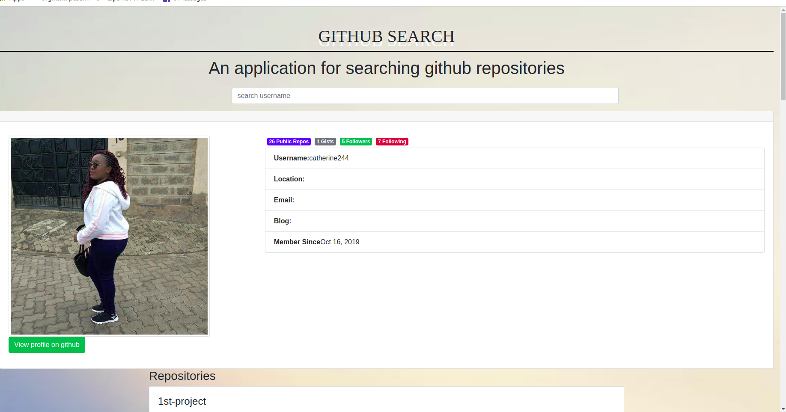

## Project Name
- Github profile search
## Author
- Catherine Nduku
## Descriptio
- A search-hub that enables one  to search github users and their repositories.

## Technologies Used
- This project was generated with Angular CLI version 7.1.4.
- HTML & CSS (Bootstrap)
## Setup Instructions and Installation
- Clone this repository to a location in your file system.
- Open terminal command line then navigate to the root folder of the application.
- Run ng serve command.
- Navigate to http://localhost:4200/ in your browser.

## BDD

- This an application where one can search their github usernames and it displays all the content including repositories with their description and time posted,following and followers.

## Development

- To fix a bug or enhance an existing module, follow these steps:

1. Fork the repo
2. Create a new branch (git checkout -b improve-feature)
3. Make the appropriate changes in the files
4. Add changes to reflect the changes made
5. Commit your changes (git commit -am 'Improve feature')
6. Push to the branch (git push origin improve-feature)
7. Create a Pull Request

